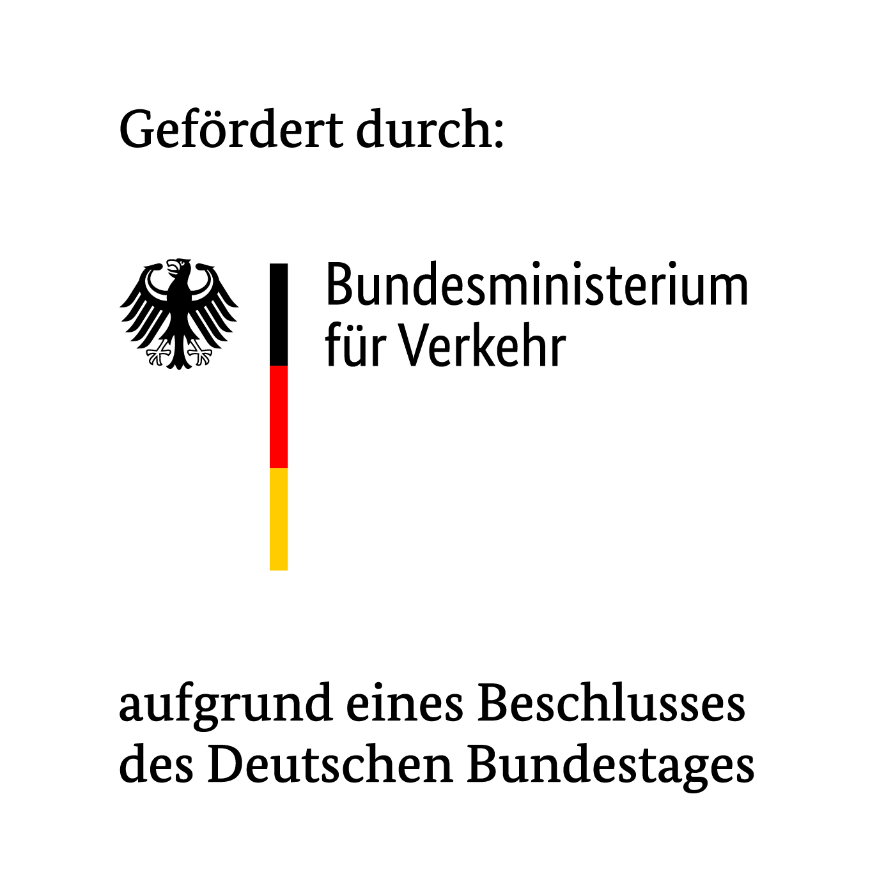

# ICLmobil

This repository contains the source code created as part of the ICLmobil project.

See the subdirectories for these major components:

- Source code of the [ICLMobil Android and iOS apps](apps/)
- Source code of the [ICLMobil Backend](backend/README.md)

## Förderung

Große Teile der in diesem Repository enthaltenen Inhalte sind im Projekt "ICLMobil" entstanden,
das im Rahmen des Betrieblichen Mobilitätsmanagements gefördert wurde.

 
Gefördert durch das Bundesministeriums für Verkehr aufgrund eines Beschlusses des Deutschen Bundestages