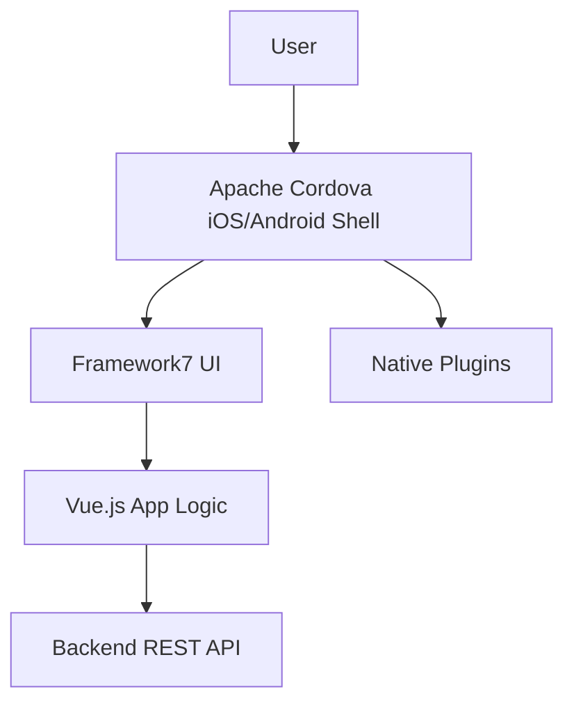
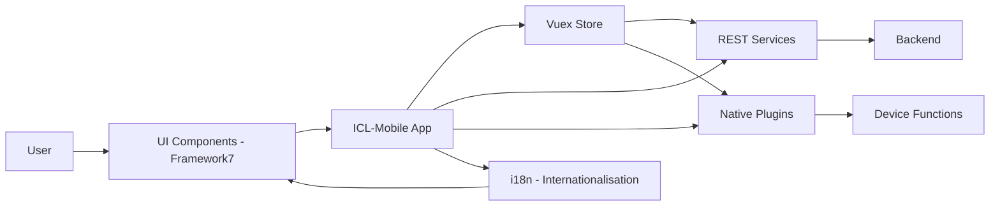

# App Architecture

## App Architecture Diagram

```mermaid
graph TD
    User[User]
    Cordova[Apache Cordova iOS/Android Shell]
    Framework7[Framework7 UI]
    Vue[Vue.js App Logic]
    Plugins[Native Plugins]
    Backend[Backend REST API]

    User --> Cordova
    Cordova --> Framework7
    Framework7 --> Vue
    Cordova --> Plugins
    Vue --> Backend
```

### App Components

```mermaid
graph LR
    User[User] --> UI[UI Components - Framework7]
    UI --> App[ICL-Mobile App]
    App --> Store[Vuex Store]
    App --> Services[REST Services]
    App --> Plugins[Native Plugins]
    App --> I18n[i18n - Internationalisation]
    Store --> Services
    Store --> Plugins
    Services --> Backend[Backend]
    Plugins --> Device[Device Functions]
    I18n --> UI
```

[Back to Table of Contents](README.md)
