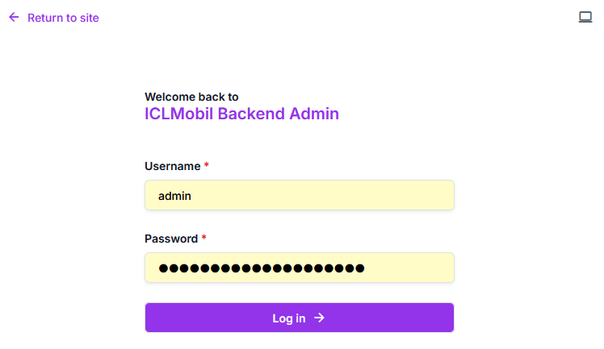

# Logging in

Using a web browser, visit https://PUBLIC_URL/admin-backend/ .

This login window should appear:

Log in using an administrative user, e.g. one that has `Superuser status`.
One such user always exists: Username `admin` with a password that was chosen when setting up the `.env` file.
