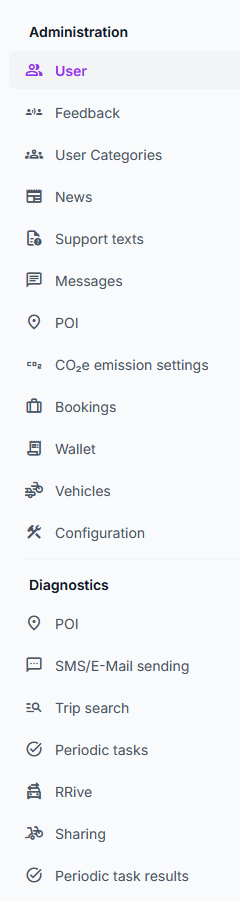

# Main menu

The menu appear on the left side after logging in. If the browser window is narrow, it will only show after clicking
the icon on the top left:

The menu contains the following items:

## Administration

- **User**: List and manage users both for administration users as well as users used by the frontend apps.
- **Feedback**: See feedback sent via the app.
- **User Categories**: These are categories (or affiliations) a user can choose from when setting up the app. 
- **News**: Since news are mainly synchronized automatically, this menu entry is mainly for viewing what is also shown
  in the app. Nevertheless, it is possible to manually add menu entries here.
- **Support texts**: Texts shown in the app settings (gear icon) -> App information -> Help. Some entries have special names
  in "Name of entry" that fill corresponding pages in the app like App information -> Legal. 
- **Messages**: Shows the messages sent to users as push notifications.
- **POI**: Contains points-of-interest that are useful for finding specific points by name when searching in the app.
  The bulk of the entries will be public transport stops that are synchronized automatically to the backend.
- **CO₂e emission settings**: Configure how much CO₂e should be used for CO₂ wallet entries per mode of transport.
- **Bookings**: Allows to list and change bookings of users.
- **Wallet**: Lists wallet entries and also contains an export function that can be used to generate statistics using a
  spreadsheet application.
- **Vehicles**: Masterdata management for sharing vehicles. Also shows current state as synchronized from sharing provider's
  backend.
- **Configuration**: Contains technical configuration settings that are used by the app.

## Diagnostics

- **POI**: Shows state of synchronization and allows test searches for POIs.
- **SMS/E-Mail sending**: Shows diagnostics regarding SMS and e-mail sending. Allows to test-send a verification SMS to 
  a mobile number.
- **Trip search**: Implements the same search functionality that the app uses. Useful to find out what a user would see
  as trip results given their location, destination and other parameters.
- **Periodic tasks**, **Periodic task results**: Shows last state of periodic tasks like the external news synchronization.
- **RRive**: Allows manual request of ride offerings from RRive. Useful for testing the integration state.
- **Sharing**: Shows low-level results as the sharing provider's backend reported them.

Screenshot of the menu entries:

