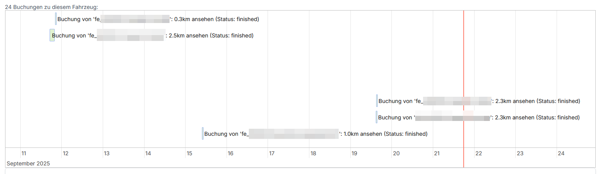

# Vehicles

The vehicle detail view has a calendar view on top that shows bookings of this vehicle.
The view can be zoomed and dragged with the mouse and looks like this:

## Special fields

- **Availability**: Allows to manually set a vehicle to a hidden state. Useful if it is known to be in maintenance.
- **Battery level percent** and **Remaining rang km**: For vehicles with an external provider backend, these 
  values are automaticallly synchronized.
- **Unlock secret**: If filled, the user will be presented with a dialog showing the text in 
  **Unlock secret user hint**. They are then required to enter the secret value to be allowed to unlock the vehicle.
  This is useful if unlocking should only be possible when one can see the vehicle which could have the secret printed
  onto it. If empty, unlocking happens without further request.
- **User hint start** and **User hint end**: Information shown to the user when starting or ending a booking.
  Used for telling them where to find accessory for the vehicle.
- **Lock state**: For vehicles with an external provider backend, automaticallly synchronized from there.

## Additional buttons

- **Lock IMMEDIATELY** and **Unlock IMMEDIATELY**: Sends a request to the sharing provider without further conformation.
  Note that locking a vehicle in transit might be a dangerour operation!
- **History**: Also shows lock and unlock operations via the mobile app.
