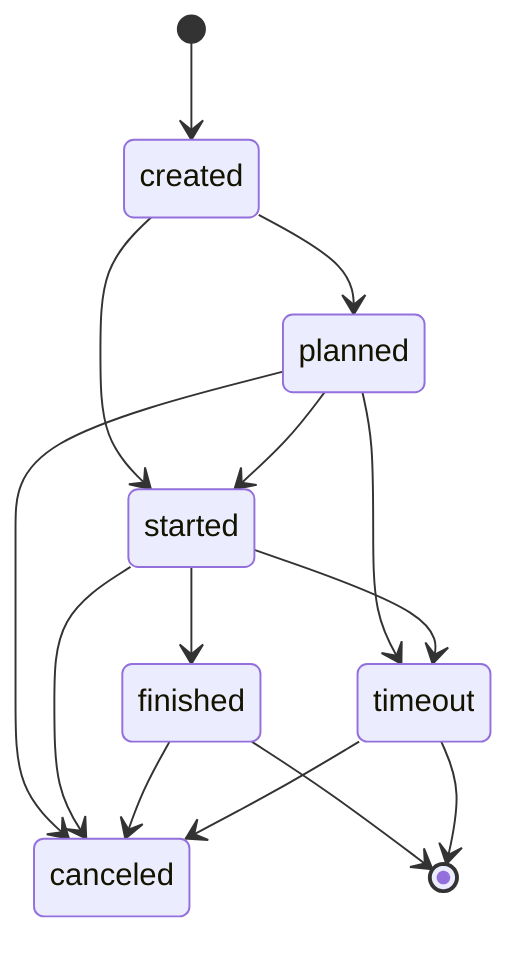

# Bookings

When users plan or start a trip, a booking entry is created in the database.
It has a "mode of transport" (public transport, sharing offering etc.), a start/end timestamp and a start/end location.

## Distance

A booking keeps track of a distance travelled in several cases
with the first available data being used:

- If an external service (like car pooling) reports a distance, that is used.
- If a trace is available, the length of the trace is used.
  The length is the sum of the distance between each two positions recorded as part of the booking.
  Traces are not used yet.
- If both a start and end location is available, the air distance between those is used.

## State

The state of a booking changes like this (see `backend/models.py -> Booking`):

Most state changes are triggered via the API from the frontend as part of the application.

One special case is `timeout` which is automatically set if a booking is
stuck in `planned` or `started` for too long (currently 24h).

Canceled is an alternate final state that removes the booking from statistics even if it finished earlier.

When the state (or some other internal data) changes, a corresponding Wallet entry is created or updated.
See [CO2e calculation](co2.md) for details on that.

## Asset capacity use

Bookings in states `planned` and `started` use their asset for their planned time range.
This means no two bookings with the same asset in these states can have overlapping time ranges.
Creating or changing a booking which would violate that rule will fail as documented in the APIs.

For trip searches where only a start time is given in the search, a default duration (`SHARING_DEFAULT_DURATION_SECONDS`)
is assumed. No assets are returned that have another booking in state planned/started from the search start time until
that duration. 

If the asset is free for that duration, another database lookup determines when/if another booking follows the suggested trip.
If so, the duration between the search start time and the start time of the following booking is returned as `maximumDurationH`.
This is limited to `SHARING_MAXIMUM_DURATION_SECONDS` which is also the default returned if no other booking follows.

## Locking/unlocking

If a (sharing) booking has a vehicle associated, locking/unlocking is available via the `/api/v1/assets/unlock`
and `/api/v1/assets/lock` endpoints. (Successful) action on these endpoints changes the vehicle's _Lock state_
value.

Optionally, `unlock` can require specifying an _unlock secret_, entered by the user. This is activated by storing the
secret in the vehicle's Unlock secret field. If that is non-empty, `unlock` will only work if the same secret is passed
to the API endpoint. This can be used to verify that the user can actually read the secret which is assumed to be
printed on the physical device itself.

The actual functionality depends on the provider name and is currently:

- Provider `SharingOS`: Should work as expected. Note that a successful return message (or API result) indicates that
  the SharingOS backend reported that the operation was successful. In reality, communication problems between the
  SharingOS backend and the device itself cannot be detected by this backend and are reported as successful.
  The operation might be performed later.
- Provider `ICL` with `Dummy` in the vehicle model field: Locking and unlocking actually does nothing in reality
  but acts like it works. If it also contains `fail`, calls to `lock`/`unlock` will behave like the underlying
  service failed (e.g. a connection problem with another provider like SharingOS). If the string `fail` is not in the
  vehicle model field, calls to `lock`/`unlock` succeed.

The rules for _unlocking_ are as follows:

- Only users which have a booking for a vehicle can unlock.
- If _unlock secret_ is set in the vehicle entry, it needs to be provided.
- The booking time range must have start at most 5 minutes into the future.
- The booking time range must not have ended already.
- The booking state must be _planned_ or _started_ (and not _created_ or _finished_).

The rules for _locking_ are as follows:

- The user needs to have a valid (_planned_/_started_) and timely (current time is in booking time range) booking
  or the user needs to be the last user who had a valid booking for this vehicle.

## Diagnostics

Bookings can be views and manually changed via `/admin-backend/` -> Diagnostics -> Bookings.