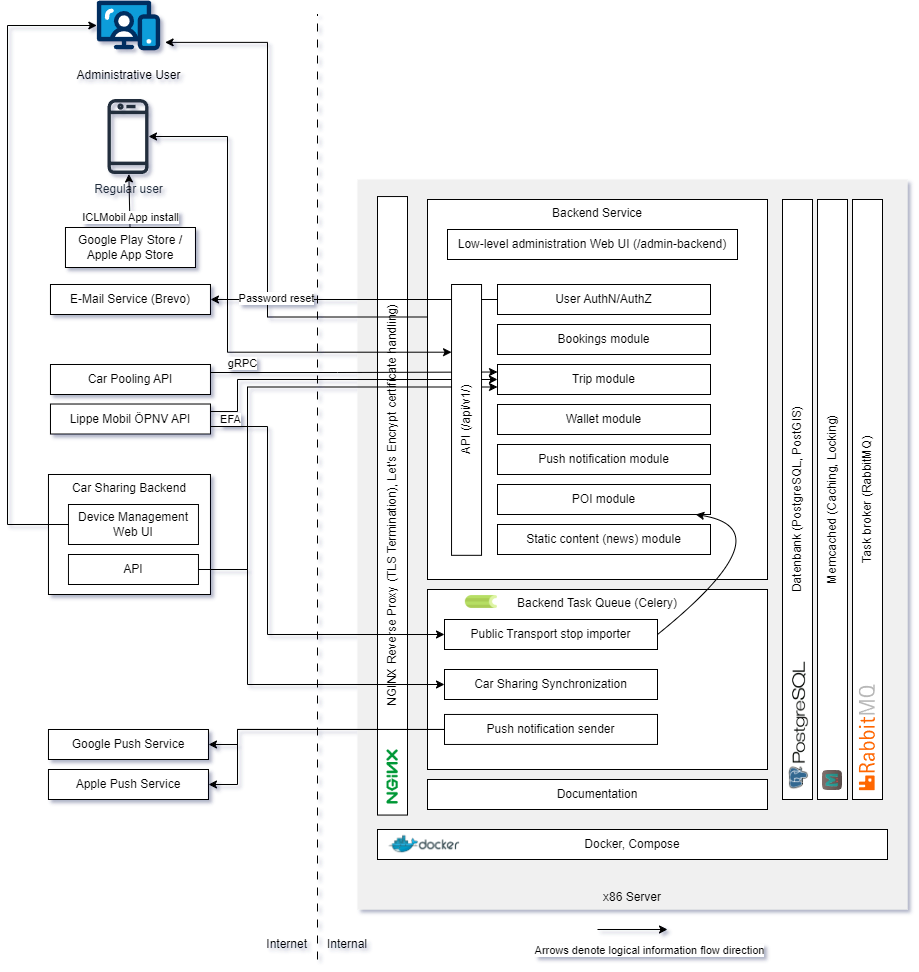

# ICLMobil Architecture

## ICLMobil components

1. Frontend: This is implemented as both an iOS and an Android app. The app is not part of this repository.
2. Authentication/authorization: The Nginx Reverse proxy calls the backend
   for all policy decisions, e.g. if a request is allowed or rejected.
   More fine-grained authorization decisions are also made in the API layer.
   Authorization rules are documented in [authorization.md](authorization.md).
3. Backend services: The app logic is running as a web-based API in the path
   `/api/v1/` and `/files/v1/`. The code is part of the backend container image which
   is built from [`containers/backend/`](../../../backend).
   Services include:
   1. Low-level administration web UI (for POI setup, diagnostics etc.) under `/admin-backend/`
   2. User authentication/authorization APIs for use by the frontend.
      Also hosts the logic for AuthN/AuthZ policy decisions enforced by Nginx.
   3. Bookings API: Manages planned trips
   4. Trip API: Implements unified search for offerings
   5. Wallet API: Manages non-monetary quantities like CO2e per user
   6. Push notification handling
   7. POI API: Manage points-of-interest by type and with location
   8. Static content API: Manage static content blocks for news
4. Backend background tasks: Logic that runs on-demand or permanently outside a user API request's lifetime.
   Tasks include:
   1. Public transport stop importer: Regularly (daily) imports the public transport stops
      as POIs for use in destination search results.
   2. _SharingOS_ backend client: Polls the _SharingOS_ backend API to determine the state of the
      sharing devices.
   3. Push notification sender: Handles actual sending of push notifications via 
      [FCM (TBD)](https://firebase.google.com/docs/cloud-messaging)/[APNs](https://developer.apple.com/documentation/usernotifications/sending-notification-requests-to-apns)
   4. Periodic update of users' experience and point scores
   5. Periodic handling of timed out bookings
   6. Static content synchronization (news)
5. Documentation: Served as `/documentation` for administrative personnel. Also
   visible in git under [containers/documentation/docs/](../index.md).

## Infrastructure components

- [PostgreSQL](https://www.postgresql.org/) with [PostGIS](https://postgis.net/)
  is used as a general RDBMS (users, POIs etc.) and for GIS
  related data (e.g. POIs with ordering by distance).
- [Memcached](https://memcached.org/) is used for short-term caching and inter-process locks.
- [RabbitMQ](https://www.rabbitmq.com/) is used as ephemeral task queue and state broker.
- [Nginx](https://nginx.org/) is used as a revers proxy that also enforces AuthN/AuthZ
  policy decisions made by the backend. All incoming requests go through Nginx.
- [Docker](https://www.docker.com/) is used for container building with the _compose_ 
  plugin for container orchestration.
    

## Automatisierte Tests

Run `manage/run-tests.sh` to run the automated test suite.
